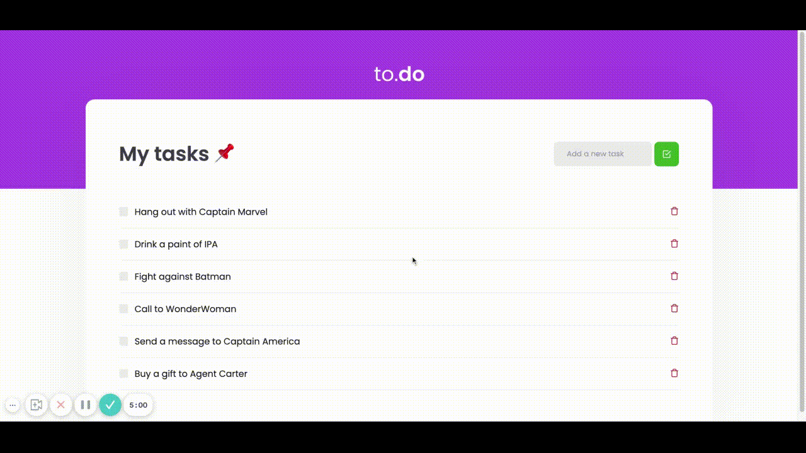

<p align="left">
   
</p>

# ToDo List

> Organize your tasks with this simple ToDo List

[](https://github.com/jennifertakagi)
[](#)
[](https://github.com/jennifertakagi/todo-list/stargazers)
[](https://github.com/jennifertakagi/todo-list/network/members)
[](https://github.com/jennifertakagi/todo-list/graphs/contributors)

---

# :pushpin: Table of Contents

* [Features](#rocket-features)
* [UI Documentation](#framed_picture-ui-documentation)
* [Installation](#construction_worker-installation)
* [Getting Started](#runner-getting-started)
* [FAQ](#postbox-faq)
* [Found a bug? Missing a specific feature?](#bug-issues)
* [Contributing](#tada-contributing)
* [License](#closed_book-license)

<br />

# :rocket: Features

* Add a new task on ToDo application
* Remove a task on ToDo application
* Complete a task on ToDo application

# :framed_picture: UI Documentation
This project has a UI Documentation of reusable components, allowing to test them individually.

<p align="left">
   
</p>

# :construction_worker: Installation

**You need to install [NPM](https://www.npmjs.com/) and [Live Server](https://www.npmjs.com/package/live-server) first, then in order to clone the project via HTTPS, run this command:**

```git clone https://github.com/jennifertakagi/todo-list.git```

SSH URLs provide access to a Git repository via SSH, a secure protocol. If you have a SSH key registered in your Github account, clone the project using this command:

```git clone git@github.com:jennifertakagi/todo-list.git```

**Install dependencies**

You need to install the dependencies, so **run the above command on root folder**:

```yarn | npm i```

# :runner: Getting Started

Run the following command in root folder to start the application in a development environment:

```yarn dev | npm run dev```

# :runner: Testing

Run the following command in root folder to run all the unit tests:

```yarn test | npm run test```


# :postbox: Faq

**Question:** What are the technologies used in this project?

**Answer:** The technologies used in this project are [React JS](https://pt-br.reactjs.org/), [TypeScript](https://www.typescriptlang.org/) and [React Test Library](https://testing-library.com/docs/react-testing-library/intro/).

# :bug: Issues

Feel free to **file a new issue** with a respective title and description on the [ToDo List](https://github.com/jennifertakagi/todo-list/issues) repository. If you already found a solution to your problem, **i would love to review your pull request**! Have a look at our [contribution guidelines](https://github.com/jennifertakagi/todo-list/blob/master/CONTRIBUTING.md) to find out about the coding standards.

# :tada: Contributing

Check out the [contributing](https://github.com/jennifertakagi/todo-list/blob/master/CONTRIBUTING.md) page to see the best places to file issues, start discussions and begin contributing.

# :closed_book: License

Released in 2021.
This project is under the [MIT license](https://github.com/jennifertakagigo-/github-explorer/master/LICENSE).

